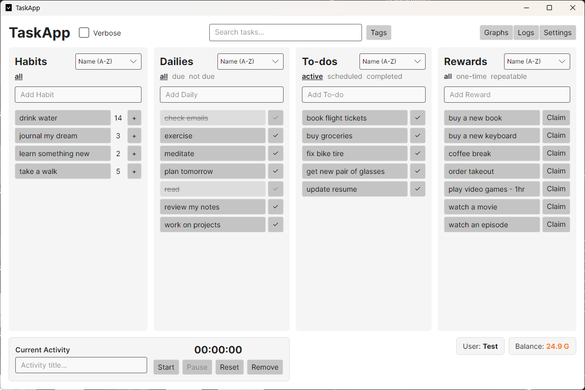
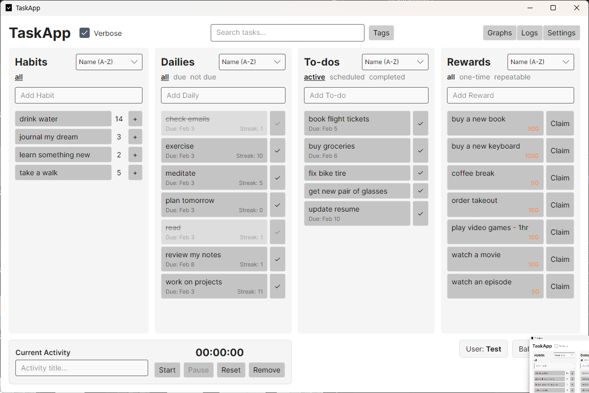
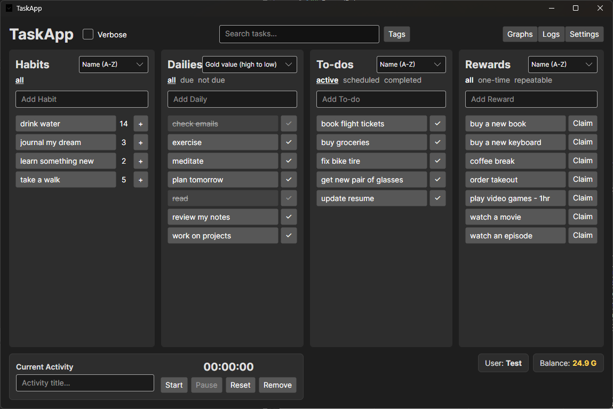
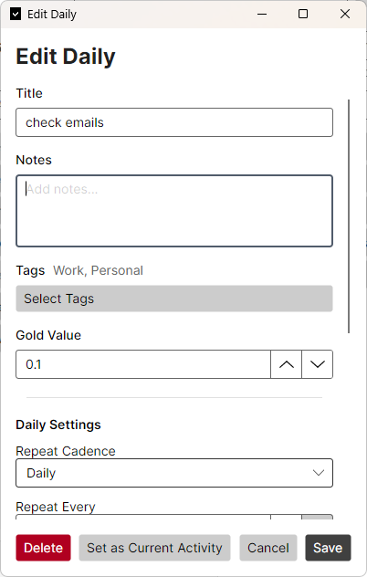
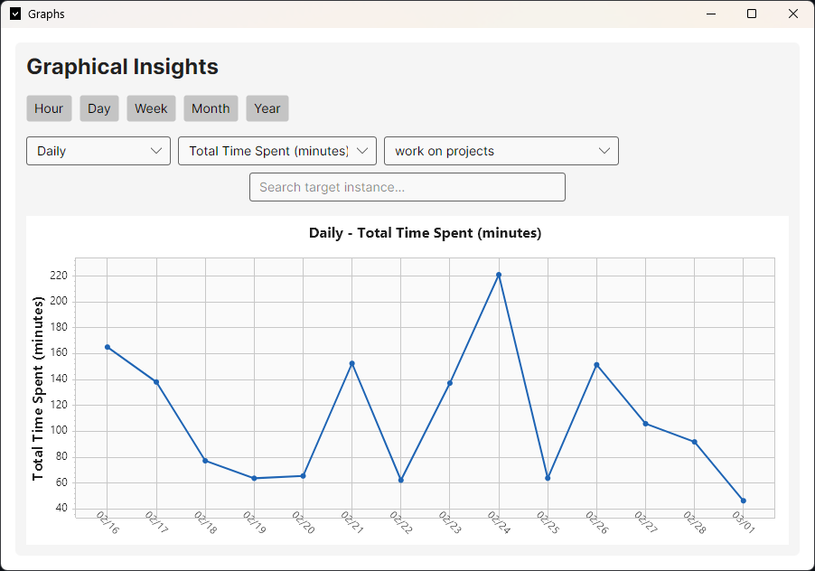
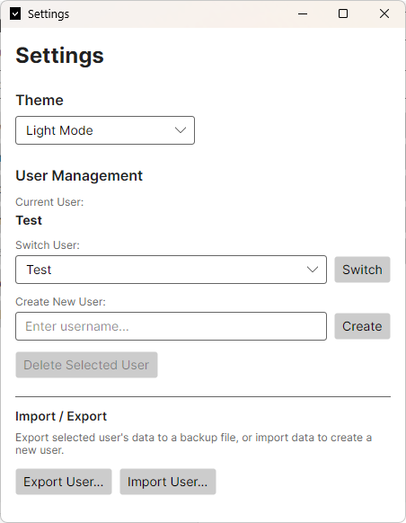

# TaskApp

A gamified task management desktop application built with **Avalonia UI** and **.NET 8**. Track habits, dailies, and todos while earning gold rewards to stay motivated.


## Features

### 📋 Task Management
- **Habits** – Repeatable actions with increment/decrement counters and optional reset cadences (daily, weekly, monthly)
- **Dailies** – Recurring tasks with streak tracking and customizable schedules (daily, weekly, monthly, yearly)
- **Todos** – One-time tasks with optional due dates and checklists

### 🏆 Gamification
- **Gold System** – Earn gold by completing tasks, spend it on custom rewards
- **Streak Bonuses** – Earn bonus gold for maintaining daily streaks (7, 14, 30+ days)
- **Rewards Shop** – Create custom rewards to purchase with earned gold (one-time or repeatable)

### 📊 Analytics & Insights
- **Graphs** – Visualize your productivity over time (hourly, daily, weekly, monthly, yearly views)
- **Activity Logs** – Track all task completions and reward claims with timestamps
- **SQLite Database** – Persistent local storage for logs and analytics

### 🎨 Customization
- **Light/Dark Themes** – Switch between visual themes
- **Multiple Users** – Support for multiple user profiles with separate data
- **Tags** – Organize tasks with custom tags
- **Sorting & Filtering** – Multiple sort options and filter tabs for each task type

### 💾 Data Management
- **JSON Export/Import** – Backup and restore your data
- **Per-User Data Storage** – Each user has isolated task and reward data

## Screenshots

### Main Window


### Main Window (Verbose Mode)


### Dark Mode


### Edit Task Form


### Graphs & Analytics


### Settings


## Getting Started

### Prerequisites
- [.NET 8 SDK](https://dotnet.microsoft.com/download/dotnet/8.0)

### Build & Run

```bash
# Clone the repository
git clone https://github.com/hyi96/TaskApp.git
cd TaskApp

# Build the project
dotnet build

# Run the application
dotnet run --project TaskApp
```

### Publish (Optional)

```bash
# Create a self-contained executable
dotnet publish -c Release -r win-x64 --self-contained
```

## Project Structure

```
TaskApp/
├── Models/
│   ├── Tasks/          # HabitTask, DailyTask, TodoTask, ChecklistItem
│   ├── Rewards/        # Reward model
│   ├── Logs/           # LogEntry for activity tracking
│   ├── Tags/           # Tag model
│   └── User.cs         # User and UserProfile models
├── ViewModels/         # MVVM ViewModels
├── Views/              # Avalonia XAML views
├── Services/           # StorageService, UserService, SettingsService
├── Converters/         # XAML value converters
└── Data/               # Data transfer objects for serialization
```

## Technology Stack

| Component | Technology |
|-----------|------------|
| UI Framework | [Avalonia UI 11](https://avaloniaui.net/) |
| Runtime | .NET 8 |
| Database | SQLite (Microsoft.Data.Sqlite) |
| Charts | [ScottPlot](https://scottplot.net/) |
| Architecture | MVVM |

## Usage Tips

- **Quick Add**: Type a task name and press `Enter` to quickly add it
- **Edit Tasks**: Click on any task to open the edit form with full options
- **Search**: Use the search bar to filter tasks across all categories
- **Verbose Mode**: Toggle "Verbose" checkbox to see detailed information
- **New Day Detection**: The app automatically detects day changes and resets daily tasks

## License

This project is licensed under the MIT License - see the [LICENSE](LICENSE) file for details.

## Contributing

Contributions are welcome! Feel free to open issues or submit pull requests.
