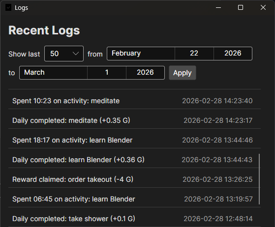

# TaskApp

A gamified task management desktop application built with **Avalonia UI** and **.NET 10**. Track habits, dailies, and todos while earning gold rewards to stay motivated.


## Features

### 📋 Task Management
- **Habits** – Repeatable actions with increment/decrement counters and automatic resets (daily, weekly, monthly)
- **Dailies** – Recurring tasks with streak tracking, customizable schedules (daily, weekly, monthly, yearly), and optional time-based autocomplete
- **Todos** – One-time tasks with optional due dates (with time), checklists, and overdue highlighting
- **Hide/Unhide** – Archive and restore tasks or rewards without deleting them
- **Sorting** – Per-category sort modes (name, created date, gold, streak, due date, etc.) that persist across sessions
- **Filtering** – Filter tabs for each task type (e.g. active/completed, scheduled/unscheduled)
- **Auto-Resorting** – Columns re-sort automatically when task properties change
- **Context Menus** – Right-click tasks and rewards for quick actions

### 🏆 Gamification
- **Gold System** – Earn gold by completing tasks, spend it on custom rewards
- **Streak Bonuses** – Earn bonus gold for maintaining daily streaks (configurable milestones)
- **Streak Protection** – Protect daily streaks by paying a configurable gold cost per missed period instead of losing the streak
- **Vacation Mode** – Toggle vacation mode to automatically protect all daily streaks at no gold cost during absences
- **Rewards Shop** – Create custom rewards to purchase with earned gold (one-time or repeatable)

### ⏱️ Current Activity Timer
- **Time Tracking** – Set any task as your current activity and track time spent on it
- **Pause/Resume** – Pause the timer and resume with a single button
- **Daily Autocomplete** – Dailies can auto-complete when a configurable time threshold is reached
- **Overdue Highlighting** – Overdue dailies are visually highlighted with red titles

### 📊 Analytics & Insights
- **Graphs** – Visualize productivity over time (hourly, daily, weekly, monthly, yearly views)
- **Activity Logs** – Track all task completions and reward claims with timestamps, gold changes, and activity durations
- **Log Filtering** – Filter logs by date range and limit count
- **New Day Detection** – Automatically detects day changes with a review window to check off missed dailies or protect their streaks (supports multi-day gaps)
- **Undo System** – Undo any logged action from the Logs window with full state reversal including streak protection rollback

### 🎨 Customization
- **Light/Dark Themes** – Switch between visual themes
- **Multiple Users** – Support for multiple user profiles with separate data
- **Tags** – Organize tasks with custom tags
- **Verbose Mode** – Toggle detailed information including due dates and streak details

### 💾 Data Management
- **Export/Import** – Backup and restore user data as `.taskapp` ZIP archives
- **Per-User Data Storage** – Each user has isolated data (tasks, rewards, tags, logs)
- **UTC-Aware Timestamps** – All timestamps use `DateTimeOffset` for correct display across time zones

## Screenshots

### Main Window


### Dark Mode


### Main Window (Verbose Mode)


### Edit Task Form


### Logs Window


### Graphs & Analytics


### Settings


## Getting Started

### Prerequisites
- [.NET 10 SDK](https://dotnet.microsoft.com/download/dotnet/10.0)

### Build From Source & Run

```bash
# Clone the repository
git clone https://github.com/hyi96/TaskApp.git
cd TaskApp

# Build the project
dotnet build

# Run the application
dotnet run --project TaskApp
```

### Running Tests

The test project targets .NET 10 and uses xUnit with Avalonia headless testing.

```bash
dotnet test TaskApp.Tests
```

## Project Structure

```
TaskApp/                    # Main application (.NET 10)
├── Models/
│   ├── Tasks/              # HabitTask, DailyTask, TodoTask, ChecklistItem, StreakBonusRule
│   ├── Rewards/            # Reward model
│   ├── Logs/               # LogEntry for activity tracking
│   ├── Tags/               # Tag model
│   ├── DomainEntity.cs     # Base class for tasks and rewards
│   ├── User.cs             # User and UserExportMetadata
│   └── UserProfile.cs      # User preferences (gold, sort modes, vacation mode)
├── ViewModels/             # MVVM ViewModels
│   ├── MainWindowViewModel.cs      # Core app logic, filtering, sorting, logging
│   ├── CurrentActivityViewModel.cs # Timer, autocomplete detection
│   ├── LogsViewModel.cs            # Log display with date filtering
│   ├── GraphViewModel.cs           # Productivity charts
│   ├── NewDayViewModel.cs          # Day-change handling and streak protection
│   └── *FormViewModel.cs           # Task and reward edit forms
├── Views/                  # Avalonia XAML views
├── Services/
│   ├── StorageService.cs   # JSON + SQLite persistence
│   ├── UserService.cs      # Multi-user, export/import
│   ├── SettingsService.cs  # Theme and app settings
│   ├── DayDetectionService.cs # Day-change detection
│   ├── TaskMapper.cs       # Model ↔ Data mapping
│   └── RewardMapper.cs     # Model ↔ Data mapping
├── Converters/             # XAML value converters
└── Data/                   # Data transfer objects for JSON serialization
TaskApp.Tests/              # xUnit test project (.NET 10)
├── DailyAutocompleteTests.cs       # Autocomplete threshold logic
├── DailyTaskTests.cs               # Daily task period and completion logic
├── StreakProtectionTests.cs         # Streak protection and vacation mode
├── NewDayCompletionTests.cs        # New day window check/protect flow
├── MainWindowViewModelTests.cs     # Filtering and sorting
├── CurrentActivityViewModelTests.cs # Timer and autocomplete UI tests (Avalonia Headless)
└── ImportExportTests.cs            # Export/import round-trip tests
```

## Technology Stack

| Component | Technology |
|-----------|------------|
| UI Framework | [Avalonia UI 11.3.9](https://avaloniaui.net/) |
| Runtime | .NET 10 |
| Database | SQLite (Microsoft.Data.Sqlite) |
| Charts | [ScottPlot 5](https://scottplot.net/) |
| Architecture | MVVM |
| Testing | xUnit 2.9.3 + Avalonia.Headless.XUnit (.NET 10) |

## Usage Tips

- **Quick Add**: Type a task name and press `Enter` to quickly add it
- **Edit Tasks**: Click on any task to open the edit form with full options
- **Context Menus**: Right-click tasks or rewards for quick actions (set as current activity, hide/unhide, etc.)
- **Current Activity**: Set a task as your current activity to track time spent on it
- **Search**: Use the search bar to filter tasks across all categories
- **Verbose Mode**: Toggle "Verbose" checkbox to see detailed information including last-completed times
- **New Day Detection**: The app automatically detects day changes, resets daily tasks, and resets habit counters based on cadence
- **Streak Protection**: When the new day window appears, toggle "Protect" to pay gold and keep a daily's streak instead of losing it
- **Vacation Mode**: Enable vacation mode to automatically protect all daily streaks at no gold cost while you're away
- **Hide/Unhide**: Archive tasks or rewards you don't need right now and restore them later
- **Sort Preferences**: Each task category has its own sort mode that persists between sessions
- **Log Filtering**: Use the date range picker and limit options in the Logs window to narrow down entries
- **Export/Import**: Back up your data via Settings — the `.taskapp` file is portable across time zones

## Inspirations

This project was inspired by [Habitica](https://habitica.com/), a gamified task management platform that transforms productivity into an RPG adventure.

## License

This project is licensed under the MIT License - see the [LICENSE](LICENSE) file for details.

## Contributing

Contributions are welcome! Feel free to open issues or submit pull requests.
